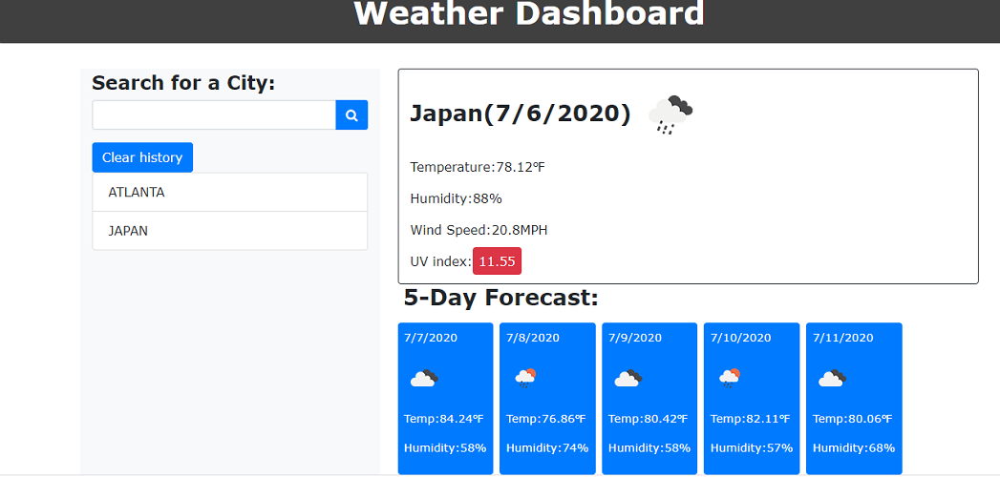

# Weather Dashboard

## Description

This application is a weather dashboard that uses the "Open weather" API that lets the User see the current weather condtions of a city as well as a 5-day forecast.

## Table of Contents

- [Installation](#Installation)
- [Usage](#Usage)
- [License](#License)
- [Questions](#Questions)

## Installation

You can view it here https://codeb-a.github.io/Weather-Dashboard/

## Usage

The User can type a city name in the search box to return any city with the current weather as long as a 5-day forecast.

## License

MIT

## Questions

For additional information please contact me via GitHub at [https://github.com/codeb-a](https://github.com/codeb-a) or via email at [brandonakers729@gmail.com](mailto:brandonakers729@gmail.com?subject=[GitHub]%README%Generator).
